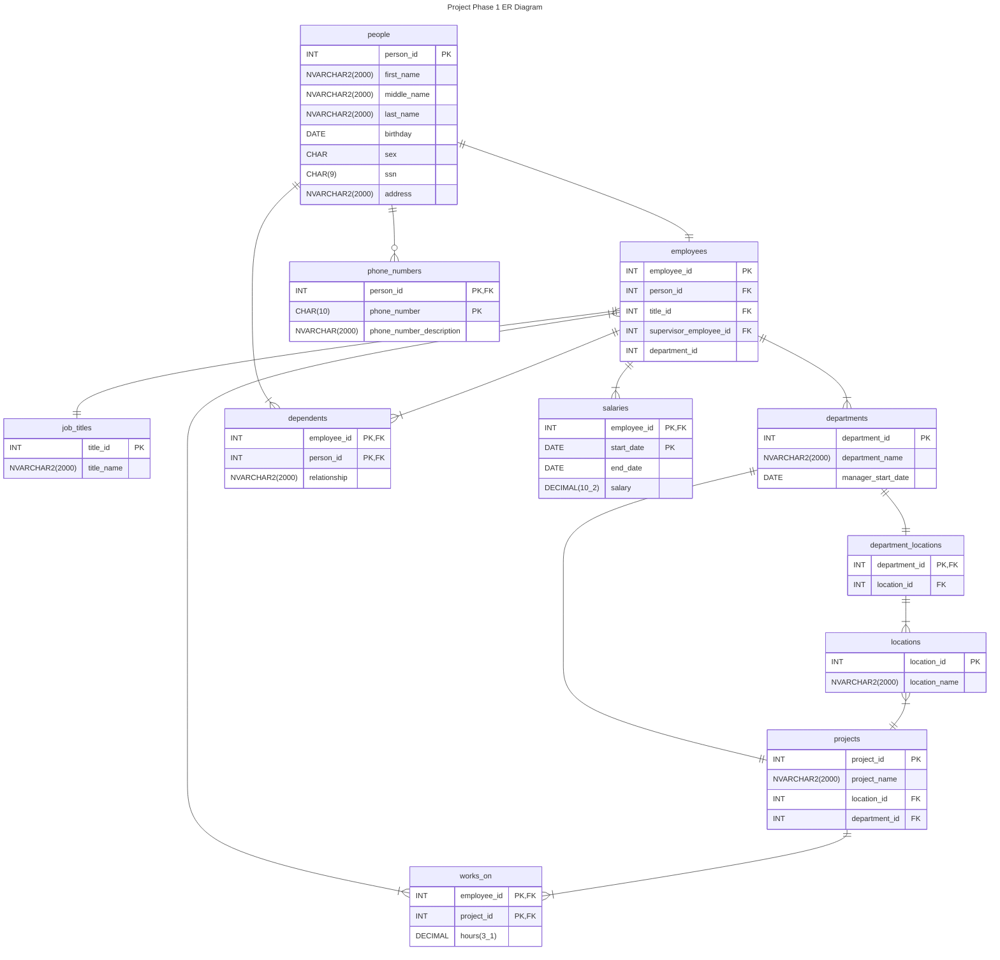

```mermaid
---
title: Project Phase 1 ER Diagram
---
erDiagram
	people {
		INT person_id PK
		NVARCHAR2(2000) first_name
		NVARCHAR2(2000) middle_name
		NVARCHAR2(2000) last_name
		DATE birthday
		CHAR sex
		CHAR(9) ssn
		NVARCHAR2(2000) address
	}

	employees {
		INT employee_id PK
		INT person_id FK
		INT title_id FK
		INT supervisor_employee_id FK
		INT department_id
	}

	job_titles {
		INT title_id PK
		NVARCHAR2(2000) title_name
	}

	works_on {
		INT employee_id PK, FK
		INT project_id PK, FK
		DECIMAL hours(3_1)
	}

	departments {
		INT department_id PK
		NVARCHAR2(2000) department_name
		DATE manager_start_date
	}

	dependents {
		INT employee_id PK, FK
		INT person_id PK, FK
		NVARCHAR2(2000) relationship
	}

	department_locations {
		INT department_id PK, FK
		INT location_id FK
	}

	locations {
		INT location_id PK
		NVARCHAR2(2000) location_name
	}
	
	projects {
		INT project_id PK
		NVARCHAR2(2000) project_name
		INT location_id FK
		INT department_id FK
	}

	phone_numbers {
		INT person_id PK, FK
		CHAR(10) phone_number PK
		NVARCHAR(2000) phone_number_description
	}

	salaries {
		INT employee_id PK, FK
		DATE start_date PK
		DATE end_date
		DECIMAL(10_2) salary
	}


	people ||--|| employees : ""
	people ||--|{ dependents : ""
	employees }|--|{ works_on : ""
	employees ||--|{ departments : ""
	employees ||--|{ dependents : ""
	departments ||--|| department_locations : ""
	departments ||--|| projects : ""
	department_locations ||--|{ locations : ""
	locations }|--|| projects : ""

	employees ||--|| job_titles : ""
	people ||--o{ phone_numbers : ""
	employees ||--|{ salaries : ""

	projects ||--|{ works_on : ""
```
